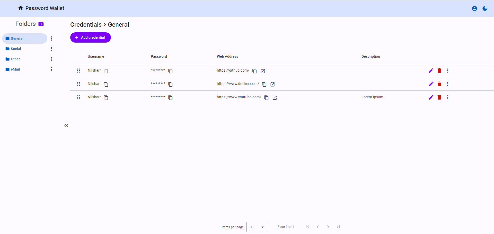

# Password Wallet

The Password Wallet is an application designed to store and manage user passwords.
The backend is written in C# using ASP.NET Core and FastEndpoints library for building the API.
The frontend is developed with Angular. The application uses PostgreSQL as the database.

## Features

- Add, update, delete, and view saved passwords.
- All passwords are stored encrypted to ensure security.
- Passwords are organized into folders for better management.
- Rearrange item positions with drag and drop.
- Generate secure passwords.
- View login history.

## Run with docker

1. Make sure you have [Docker](https://www.docker.com/) installed.
1. Clone the repository.
1. Go to cert directory and run cert.sh script to generate self signed certificate. (Requires openssl and git bash on Windows).
1. Trust the self signed ca.crt certificate.
1. Run `docker compose up` command in project root folder.
1. Navigate to https://localhost:8000.

## Integration tests

The app uses Testcontainers library to run the test database.
Docker is required to run integration tests.

## Screenshots

